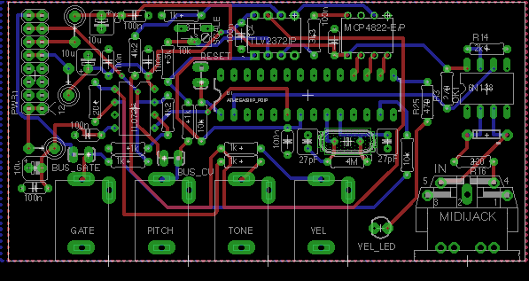
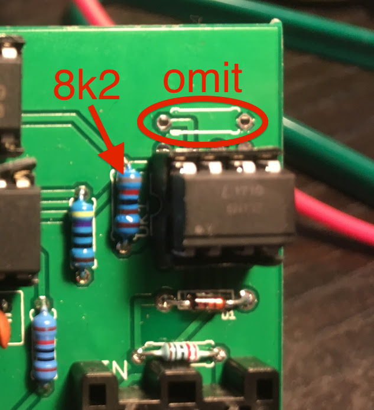

# atmega_midi_cv_basic
Simple gate+pitch+velocity with one 4822

Portamento time is controlled by MIDI CC #5.

When more than one MIDI note is active, the frequency CV is set according to the value of MIDI CC #80 as follows:

CC #80 | Note Priority
--- | ---   
0-31 | Lowest Note
32-63 | Highest Note
64-127 | Highest Velocity (default)

The MIDI channel can be set by sending the following SYSEX message: 
`0x77 0x16 0x01 0x00 0xcc` where cc is the new channel.

Parts placement for Release v0.5:

For 6N137 instead of 6N138, make use these changes:

